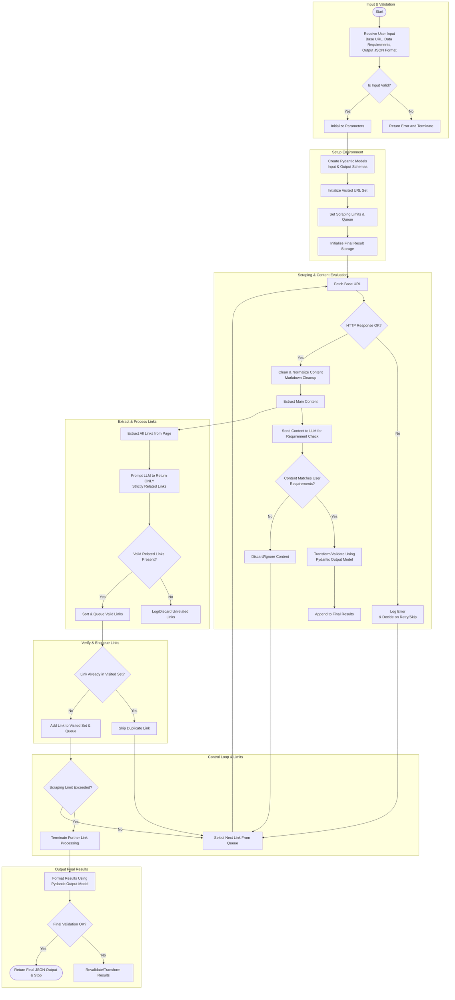

# sample flow

```mermaid

flowchart TD
%% Stage 1: Input Validation & Initialization
subgraph INPUT_VALIDATION [Input & Validation]
A([Start])
B[Receive User Input<br/>Base URL, Data Requirements,<br/>Output JSON Format]
A --> B
C{Is Input Valid?}
B --> C
C -- No --> D[Return Error and Terminate]
C -- Yes --> E[Initialize Parameters]
end

%% Stage 2: Setup
subgraph SETUP [Setup Environment]
E --> F[Create Pydantic Models<br/>Input & Output Schemas]
F --> G[Initialize Visited URL Set]
G --> H[Set Scraping Limits & Queue]
H --> I[Initialize Final Result Storage]
end

%% Stage 3: Primary Scraping Process
subgraph SCRAPING_LOOP [Scraping & Content Evaluation]
I --> J[Fetch Base URL]
J --> K{HTTP Response OK?}
K -- No --> L[Log Error<br/>& Decide on Retry/Skip]
K -- Yes --> M[Clean & Normalize Content<br/>Markdown Cleanup]
M --> N[Extract Main Content]
N --> O[Send Content to LLM for Requirement Check]
O --> P{Content Matches User<br/>Requirements?}
P -- Yes --> Q[Transform/Validate Using<br/>Pydantic Output Model]
Q --> R[Append to Final Results]
P -- No --> S[Discard/Ignore Content]
end

%% Stage 4: Link Extraction & Filtering
subgraph LINK_EXTRACTION [Extract & Process Links]
N --> T[Extract All Links from Page]
T --> U[Prompt LLM to Return ONLY<br/>Strictly Related Links]
U --> V{Valid Related Links Present?}
V -- No --> W[Log/Discard Unrelated Links]
V -- Yes --> X[Sort & Queue Valid Links]
end

%% Stage 5: Link Verification & Deduplication
subgraph VISITED_CHECK [Verify & Enqueue Links]
X --> Y{Link Already in Visited Set?}
Y -- Yes --> Z[Skip Duplicate Link]
Y -- No --> AA[Add Link to Visited Set & Queue]
end

%% Stage 6: Iteration & Limit Checks
subgraph LOOP_CONTROL [Control Loop & Limits]
AA --> AB{Scraping Limit Exceeded?}
AB -- Yes --> AC[Terminate Further Link Processing]
AB -- No --> AD[Select Next Link From Queue]
AD --> J
L --> AD
S --> AD
Z --> AD
end

%% Stage 7: Finalization & Output
subgraph FINAL_OUTPUT [Output Final Results]
AC --> AE[Format Results Using<br/>Pydantic Output Model]
AE --> AF{Final Validation OK?}
AF -- No --> AG[Revalidate/Transform Results]
AF -- Yes --> AH([Return Final JSON Output & Stop])
end

%% Edge Case Annotations:
%% - Network/HTTP errors handled at Node K.
%% - Invalid/empty user input handled at Node C.
%% - Duplicate URLs avoided via Visited Set at Node Y.
%% - LLM output strictly filtered for related links at Node U.
%% - Scraping limits enforced at Node AB.

```